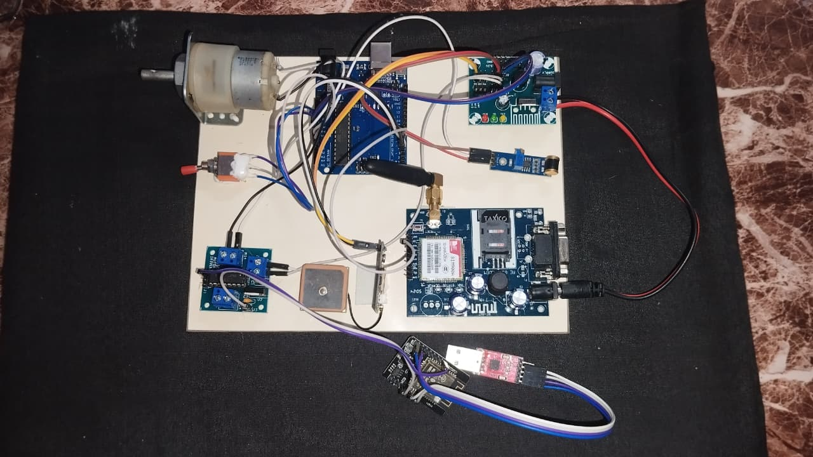
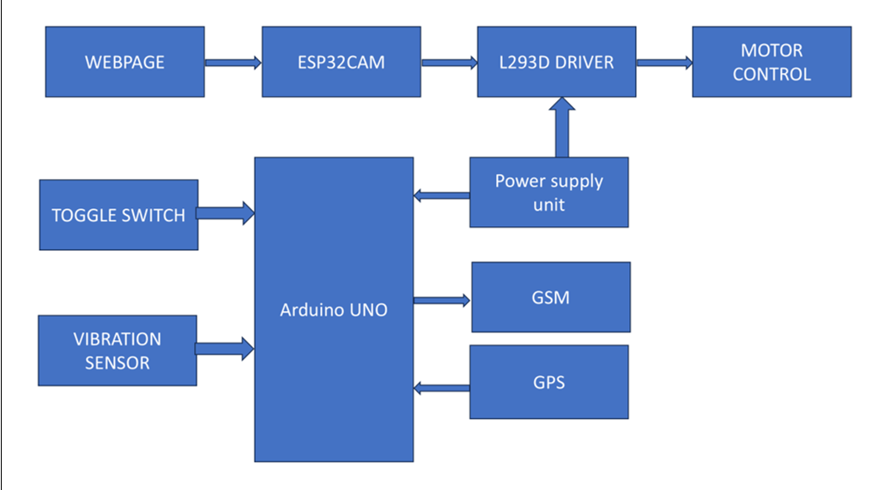

# Intelligent-Two-Wheeler-Security-Device
An IoT-based intelligent two-wheeler security system using Arduino and ESP32-CAM that provides dual-authentication ignition control, real-time GPS tracking, SIM900A GSM SMS alerts, accident detection, and live video streaming for enhanced vehicle security.

---

# Intelligent Two-Wheeler Security Device with GPS Tracking and Remote Control

## Project Overview

The **Intelligent Two-Wheeler Security Device with GPS Tracking and Remote Control** is a security and safety system designed to improve two-wheeler protection and rider safety.

The system uses a combination of an ignition key and mobile authorization to control the bike. The bike can be started only when both conditions are satisfied. This provides an additional layer of protection against unauthorized access and theft.

Once the bike is started, the system tracks its live location using GPS and sends location information to registered mobile numbers through GSM. In case an accident is detected using a vibration sensor, an emergency SMS alert is sent to the registered mobile number.

An **ESP32-CAM** is also used to provide live video streaming for monitoring the person riding or approaching the bike.

---

## Project Objectives

- Prevent unauthorized use and theft of the two-wheeler.
- Provide an additional mobile-based authorization mechanism.
- Track the live location of the bike using GPS.
- Send location information to registered mobile numbers.
- Detect possible accidents using a vibration sensor.
- Send emergency SMS alerts during accident detection.
- Provide live video streaming using ESP32-CAM.
- Improve the overall security and monitoring of the vehicle.

---

## Key Features

### 1. Dual Authorization Anti-Theft System

The main security feature of the project is a dual-authorization mechanism that combines web-based permission with a traditional physical ignition switch.

The ESP32-CAM provides a web interface through which the authorized user can give permission to start the bike. When the permission is given, the ESP32-CAM sends the motor-control signal to the L293D motor driver.

A physical switch is connected between the motor driver and the motor. This switch represents the traditional ignition/key mechanism.

The motor will run only when both conditions are satisfied:

1. The authorized user provides permission through the ESP32-CAM web interface.
2. The physical ignition switch is turned ON.

If either condition is missing, the motor will not run.

### 2. GPS Live Tracking

The GPS module obtains the current location of the bike.

The location information can be used to monitor the bike's movement and track its position.

### 3. GSM SMS Alert

The SIM900A GSM module is used to send SMS messages to registered mobile numbers.

The system can send important information such as:

- Bike location
- Security alerts
- Accident alerts

### 4. Accident Detection

A vibration sensor is used to detect sudden or abnormal vibration that may indicate an accident.

When an accident condition is detected, the system sends an emergency alert through GSM.

### 5. ESP32-CAM Live Streaming

The ESP32-CAM provides live video streaming.

The video stream can be used to monitor the person around or riding the bike and provides an additional monitoring feature.

### 6. Motor Control

The ESP32-CAM provides web-based motor control.

When the user gives permission through the ESP32-CAM web interface, the ESP32-CAM sends the control signal to the L293D motor driver.

A physical switch is placed between the motor driver and the motor and acts as the traditional ignition/key mechanism.

Therefore, the motor runs only when both the web permission and physical switch are ON.
---

## Hardware Components

The following hardware components are used in the project:

| Component | Purpose |
|---|---|
| Arduino | Handles GPS, GSM, vibration sensor, and switch-related operations |
| AI-Thinker ESP32-CAM | Provides live video streaming and web-based motor control |
| GPS Module | Provides the bike's location information |
| SIM900A GSM Module | Sends SMS alerts and location information |
| Vibration Sensor | Detects sudden or abnormal vibration for accident detection |
| Toggle Switch 1 | Acts as the physical ignition/key authorization |
| Toggle Switch 2 | Used to manually trigger an emergency alert |
| L293D Motor Driver | Drives the motor based on the control signal from the ESP32-CAM |
| Motor | Represents the two-wheeler motor in the prototype |
| Power Supply | Provides power to the system |

---

### Software Requirements

- Arduino IDE
- Arduino C/C++
- ESP32 Board Package
- AI-Thinker ESP32-CAM board support
- Required Arduino libraries

### Required Libraries

#### Arduino

The Arduino code uses the following libraries:

- **TinyGPS++** – used to process GPS data.
- **SoftwareSerial** – used for serial communication with the GPS and SIM900A GSM module.

The SIM900A GSM module is controlled using AT commands through serial communication. Therefore, a separate SIM900A/GSM library is not required.

#### ESP32-CAM

The ESP32-CAM code uses the ESP32 Arduino framework and camera components, including:

- `WiFi.h`
- `esp_camera.h`
- `esp_http_server.h`
- `esp_timer.h`
- `img_converters.h`

These components are provided through the ESP32 board package and do not need to be installed separately through the Arduino Library Manager.

The project also contains:

- `camera_index.h`

which is part of the ESP32-CAM web interface.

---

## System Working Principle

The complete system works through multiple stages.

### Step 1: Power ON

The system is powered using the power supply.

The Arduino and other connected modules are initialized.

### Step 2: Ignition and Mobile Authorization

The user turns ON the physical ignition using the key.

At the same time, the system checks for the required mobile authorization.

The bike motor is allowed to operate only when both the ignition and mobile authorization conditions are satisfied.

### Step 3: Motor Operation

When web permission is provided, the ESP32-CAM sends the motor-control signal to the L293D motor driver.

If the physical ignition switch is also ON, the electrical path to the motor is available and the motor runs.

If the physical switch is OFF, the motor does not run even when web permission is provided.

This dual-authorization mechanism helps prevent unauthorized use of the bike.

### Step 4: GPS Tracking

After the bike is started, the GPS module obtains the current location.

The location data is processed by the Arduino.

### Step 5: GSM Communication

The SIM900A GSM module is used to communicate with the registered mobile number.

The system can send location and security-related SMS messages.

### Step 6: Accident Detection

The vibration sensor continuously monitors for sudden vibrations.

If a vibration condition indicating a possible accident is detected, the system triggers an emergency alert.

The SIM900A GSM module sends an SMS alert to the registered mobile number.

### Step 7: Video Monitoring

The ESP32-CAM provides a live video stream.

This allows the user to remotely monitor the surroundings of the bike and the person riding or approaching it.

---

## Project Image

## System Architecture

---

## 🚀 Installation Guide

### 1. Install Arduino IDE

Download and install the Arduino IDE on your computer.

After installation, open the Arduino IDE.

### 2. Configure Arduino Board

Connect the Arduino board to your computer using a USB cable.

In Arduino IDE, select the appropriate Arduino board:

Tools → Board

Then select the correct COM port:

Tools → Port

### 3. Install ESP32 Board Support

The ESP32-CAM requires ESP32 board support in Arduino IDE.

Open:

File → Preferences

Add the ESP32 Board Manager URL under Additional Boards Manager URLs.

Then open:

Tools → Board → Boards Manager

Search for:

ESP32

Install the ESP32 board package.

After installation, select the appropriate ESP32-CAM board from:

Tools → Board

### 4. Install Required Libraries

Open:

Sketch → Include Library → Manage Libraries

Install the libraries required by the source code.

Make sure all required libraries are installed before compiling the project.

### 5. Upload the Arduino Code

Open the Arduino source code:

src/Arduino/Arduino-Code.ino

Select the correct Arduino board and COM port.

Click Verify to compile the program.

If there are no errors, click Upload to upload the code to the Arduino.

### 6. Upload the ESP32-CAM Code

Open:

src/ESP32-CAM/ESP32-CAM-Code.ino

Select the appropriate ESP32-CAM board from:

Tools → Board

Configure the required upload settings according to the ESP32-CAM board.

Connect the ESP32-CAM using the required programming setup and upload the program.

### 7. Configure SIM900A GSM

Insert an active SIM card into the SIM900A GSM module.

Make sure:

The SIM card is active.
The SIM card has network coverage.
SMS service is available.
The SIM card has sufficient balance if required.
The GSM module receives the required power supply.

Configure the registered mobile number in the source code.

### 8. Configure GPS Module

Connect the GPS module according to the circuit diagram.

For the first test, place the GPS module in an open area so that it can receive satellite signals properly.

Check the GPS data using the Arduino Serial Monitor.

### 9. Test the ESP32-CAM

Power ON the ESP32-CAM and connect it to the configured network.

Open the camera stream using the method provided in the ESP32-CAM program.

Verify that the live video is displayed correctly.

### 10. Test the Complete System

After uploading and configuring all modules:

Power ON the system.
Turn ON the key ignition.
Provide the required mobile permission.
Verify that the motor starts only when both conditions are satisfied.
Check GPS location tracking.
Check GSM SMS communication.
Test the vibration sensor carefully.
Verify that an accident alert is generated.
Check the ESP32-CAM live video stream.

---

## 📁 Project Folder Structure

Intelligent-Two-Wheeler-Security-Device/
│
│
├── src/
│   ├── Arduino/
│   │   └── Arduino-Code.ino
│   │
│   └── ESP32-CAM/
│       ├── ESP32-CAM-Code.ino
│       ├── app_httpd.cpp
│       └── camera_index.h
│
├── images/
│   ├── project-image.jpg
│   └── system-architecture.png
│
└── README.md
